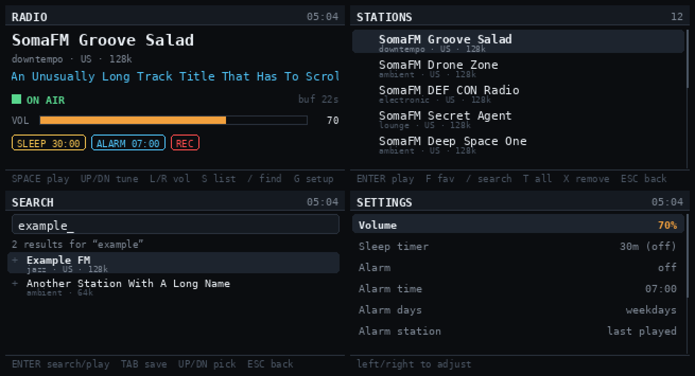

# CardputerZero Radio

Internet radio for the [M5Stack CardputerZero](https://shop.m5stack.com/pages/m5-cardputerzero) (CP0)
— a curated station list, live Radio Browser search, favourites, scrolling ICY
track titles, a sleep timer, a wake-to-radio alarm, stream recording, and an
optional boot-to-radio mode.



> **Status:** written against the documented CP0 platform and verified end to
> end in the desktop simulator, but **not yet run on real hardware** — the
> device ships from Kickstarter later. Everything that can be checked without a
> CP0 is checked in CI (113 unit tests, a seven-screen render smoke test, and a
> package-layout assertion). Expect to tune the framebuffer/keyboard device
> paths on first boot; see [Troubleshooting](#troubleshooting).

---

## How it works

The CardputerZero is a Raspberry Pi CM0 running Raspberry Pi OS, so this is a
normal Linux app rather than microcontroller firmware:

| Concern | Approach |
| --- | --- |
| Display | 320×170 RGB565 framebuffer drawn with Pillow. The LCD is located **by name** — `/proc/fb` is scanned for `fb_st7789v` — because on this device `/dev/fb0` is usually HDMI and the panel is commonly `/dev/fb1`. 32bpp framebuffers are handled too. |
| Input | The 46-key matrix keyboard read directly via `evdev`, preferring the I²C `by-path` node. Shift is tracked so you can type search queries. |
| Audio | A resident `mpv` process in `--idle` mode, driven over its JSON IPC socket. Switching stations is one `loadfile`, not a process respawn. |
| Volume | The ALSA mixer via `amixer` when a usable playback control exists, otherwise mpv's software volume. |
| Metadata | ICY `icy-title` observed on mpv's `metadata` property. |
| Packaging | An `arm64` `.deb` using the stock `APPLaunch` layout, so it appears in the launcher like any other CP0 app. |

## Install

Grab the `.deb` from [Releases](https://github.com/churchja/cardputerzero-radio/releases),
copy it to the device, and:

```sh
sudo apt install ./cardputerzero-radio_0.2.0-3_arm64.deb
```

Dependencies (`mpv`, `python3-pil`, `python3-evdev`, `python3-numpy`,
`alsa-utils`, `fonts-dejavu-core`) are pulled in automatically.

The app needs access to the framebuffer and the keyboard. On a stock image the
`pi` user is usually already in these groups; if not:

```sh
sudo usermod -aG video,input,audio pi
```

Log out and back in for that to take effect. Then launch **Radio** from the
CardputerZero menu.

## Keys

### Everywhere

| Key | Action |
| --- | --- |
| `SPACE` | Play / stop |
| `←` `→` | Volume down / up |
| `M` | Mute toggle |
| `R` | Start / stop recording |
| `/` | Search Radio Browser |
| `G` | Settings |
| `TAB` | Cycle Now Playing → Stations → Settings |
| `ESC` | Back one level |
| `ESC` (hold) | Exit the app |
| `Q` | Quit |

`ESC` follows the APPLaunch navigation contract: a short press goes back, and
only a hold of ~0.8s exits. On Settings, `←`/`→` edit the selected row instead
of changing volume.

### Now Playing

| Key | Action |
| --- | --- |
| `↑` `↓` | Previous / next station (tunes immediately) |
| `S` / `ENTER` | Open the station list |
| `F` | Favourite the current station |

### Stations

| Key | Action |
| --- | --- |
| `↑` `↓` | Move selection |
| `ENTER` | Play |
| `F` | Toggle favourite |
| `T` | Toggle all / favourites-only |
| `X` | Remove a searched station |

### Search

Type to build a query. `ENTER` runs the search; `↑`/`↓` moves into the results;
`ENTER` on a result saves and plays it; `TAB` saves without playing.

### Settings

`↑`/`↓` pick a row, `←`/`→` change the value, `ENTER` toggles. The footer
explains whichever row is selected.

## Configuration

| File | Purpose |
| --- | --- |
| `~/.config/cardputerzero-radio/stations.toml` | Your station list. Seeded on first run and **never rewritten**, so edits and comments survive upgrades. |
| `~/.config/cardputerzero-radio/saved.json` | Stations kept from in-app searches. |
| `~/.config/cardputerzero-radio/settings.json` | Volume, favourites, alarm, sleep default, recordings directory, audio device. |

Adding a station by hand:

```toml
[[station]]
name    = "My Station"
url     = "https://example.com/stream.mp3"
genre   = "talk"
country = "US"
codec   = "MP3"     # decides the recording file extension
bitrate = 128
```

`.pls` and `.m3u` wrappers are unwrapped automatically; `.m3u8` (HLS) is passed
straight to mpv, which handles it natively.

## Features worth knowing about

**No Wi-Fi.** Streaming needs the internet, so the app checks for it rather
than blaming the station. It tells three cases apart:

| State | Shown as | Meaning |
| --- | --- | --- |
| No link | **NO WI-FI** | Not associated with any network |
| Link, nothing routes | **NO INTERNET** | Associated (SSID is named) but traffic goes nowhere — dead AP or captive portal |
| Online | *nothing* | The stream itself is the broken part |

With no connection, Now Playing is replaced by a full-screen notice telling you
to connect — and that your stations and favourites are still saved. Every other
screen carries a red **NO WI-FI** flag in the header. Search refuses instantly
rather than stacking HTTP timeouts. Volume still works, and playback is still
*attempted*, because a stream on your own LAN can work with no internet route
at all.

Link state is a local `/proc/net/route` read and the internet probe is a TCP
connect on a worker thread, so neither ever stalls the render loop. Recovery is
picked up within about five seconds.

**Reconnect.** Streams drop. mpv is started with FFmpeg reconnect options, and
on top of that the app retries on a 2→4→8→15→30 second backoff, resetting once
playback recovers.

**Sleep timer.** Presets from 15 to 120 minutes. `ENTER` on the Settings row
starts or cancels it; the countdown shows as a chip on Now Playing.

**Alarm.** Wake to a chosen station on chosen days. It is edge-triggered, so it
fires once per scheduled minute. *The alarm only fires while the app is
running* — turn on autostart if you want it to be dependable.

**Recording.** `R` captures the live stream to
`~/Music/radio-recordings/<timestamp>_<station>.<ext>` using mpv's
`stream-record`, so it costs no second connection. Set `recordings_dir` in
`settings.json` to point at other storage. Recording a stream is a straight
capture — mind what you do with the files.

**Autostart.** Off by default. Toggle it in Settings: it enables a *user*
systemd unit written to `~/.config/systemd/user` when you switch it on, so no `sudo` is involved and the package installs nothing into shared system directories.

## Development

No CardputerZero required — the app falls back to a Tk simulator on a desktop.

```sh
python -m pip install Pillow numpy
python app.py --desktop --scale 3
```

```sh
python -m unittest discover -s tests -v   # 113 tests, no hardware, no network
python app.py --smoke frames              # render every screen to PNG
```

`--smoke` never starts mpv, which is what makes it safe in CI.

Useful flags: `--fb` forces the framebuffer backend, `--no-autoplay` skips
resuming the last station, `--fps` sets the loop rate.

Overrides for odd setups:

| Variable | Effect |
| --- | --- |
| `CPZRADIO_FBDEV` | Framebuffer device path |
| `CPZRADIO_KBD` | Keyboard event device path |
| `CPZRADIO_CONFIG_DIR` / `CPZRADIO_DATA_DIR` | Relocate config and data |

`LV_LINUX_FBDEV_DEVICE` and `LV_LINUX_KEYBOARD_DEVICE` are honoured too, since
that is what the stock LVGL apps use.

## Building the package

```sh
packaging/build-deb.sh          # -> dist/cardputerzero-radio_<version>-1_arm64.deb
```

Pure Python, so no cross-toolchain is needed — CI builds the `arm64` package on
an x86 runner. Tagging `v*` attaches the `.deb` to a GitHub release.

## Troubleshooting

**No sound.** Check mpv works standalone first:
`mpv --no-video https://ice1.somafm.com/groovesalad-128-mp3`. Then check the
mixer — Settings shows the detected backend as `alsa:<control>` or `mpv`. If it
says `mpv`, `amixer` found no usable playback control and volume is applied in
software.

**Blank screen.** Check which node the LCD registered as:

```sh
cat /proc/fb
awk '/fb_st7789v/ {print "/dev/fb" $1}' /proc/fb
```

The app uses that lookup automatically. If your image names the panel something
else, point it at the right node with `CPZRADIO_FBDEV=/dev/fbN`. A depth other
than 16 or 32 bpp is rejected with a clear message rather than drawing garbage.

**Keys do nothing.** Confirm you are in the `input` group and find the right
node with `ls -l /dev/input/by-path/`, then set `CPZRADIO_KBD`.

**Search fails.** Radio Browser needs outbound HTTPS; the error is shown
inline on the search screen.

## Credits

Station list defaults point at [SomaFM](https://somafm.com/),
[Radio Paradise](https://radioparadise.com/), [KEXP](https://kexp.org/),
[WFMU](https://wfmu.org/) and [FIP](https://www.radiofrance.fr/fip) — support
them if you listen. Search is powered by
[Radio Browser](https://www.radio-browser.info/).

## License

MIT — see [LICENSE](LICENSE).
